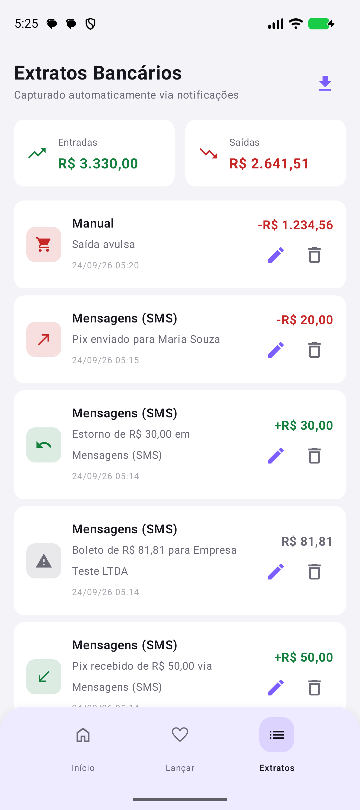
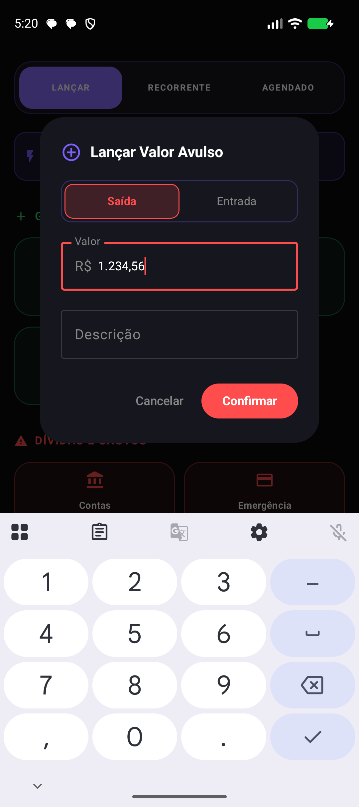
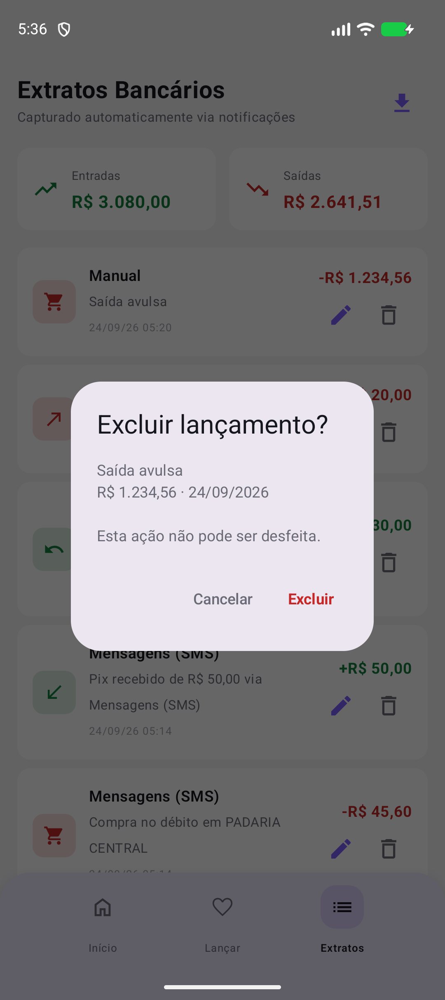
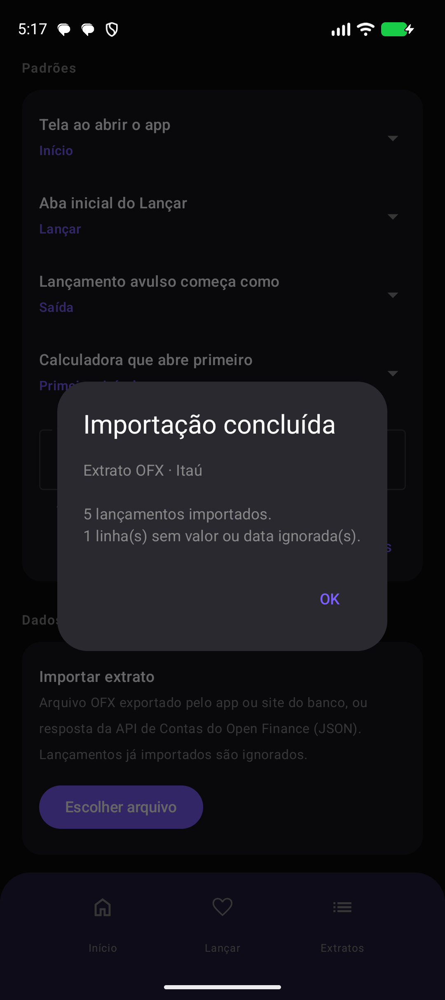
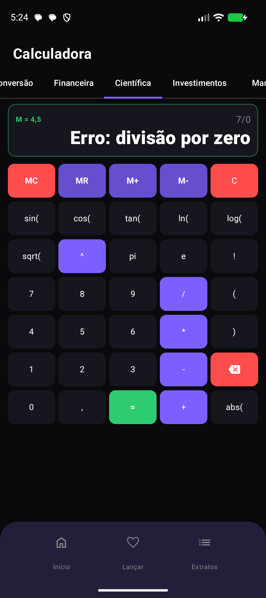
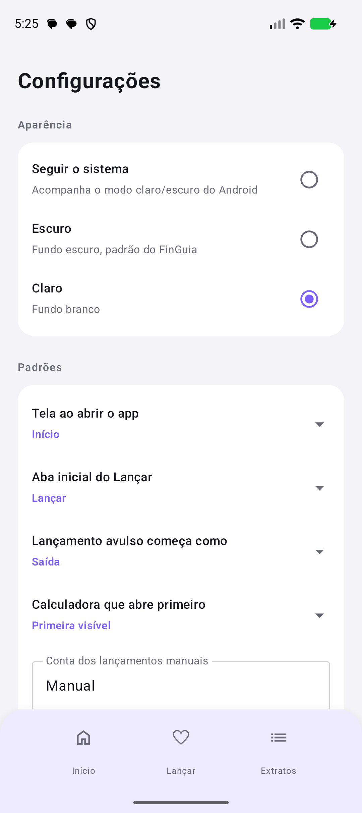

# Relatório de Testes — FinGuia

| | |
|---|---|
| **Data** | 24/09/2026 |
| **Versão testada** | branch `desenvolvimento`, commit `cc69a84` |
| **Versão anterior (atualização)** | branch `producao`, commit `06c0eba` (banco versão 5) |
| **Ambiente** | Windows · JDK 21.0.12 · Gradle 9.3.1 · AGP 8.7.3 · Kotlin 2.0.21 · Node 24.16 |
| **Aparelho** | Emulador Pixel 10, Android 17 (API 37) |

Todos os testes usaram **dados fictícios**. Nenhum dado real do app entra neste relatório nem nas capturas de tela.

---

## Resumo

| Frente | Resultado |
|---|---|
| Testes unitários | ✅ **105 de 105** |
| Teste instrumentado (dentro do Android) | ✅ **1 de 1** |
| Análise estática (lint do Android) | ✅ **0 erros** após correção (eram 2) · 93 avisos |
| Atualização da versão antiga (banco 5 → 6) | ✅ Aprovado, sem perda de dados |
| Ponta a ponta no emulador (11 roteiros) | ✅ Aprovados após correções |
| Estresse (5.000 toques aleatórios, 2 rodadas) | ✅ 0 crashes, 0 travamentos |
| FinGuia Web (servidor, interface e WAL) | ✅ 16 de 16 na interface · 10 de 10 no servidor |

**5 defeitos encontrados, 4 corrigidos durante os testes** (o quinto era de ambiente, não de código):

| # | Defeito | Gravidade | Como foi achado | Correção |
|---|---|---|---|---|
| 1 | Calculadora **fechava o app** ao voltar de aba em **Android 14 ou anterior** | 🔴 Alta | Lint (`NewApi`) + bytecode | `93e6963` |
| 2 | Lixeira **apagava sem confirmação**: um toque acidental perdia a transação de vez | 🔴 Alta | Teste de estresse apagou 2 de 14 | `f74e675` |
| 3 | Caracteres Unicode invisíveis no código-fonte (4 lugares) | 🟡 Baixa | Lint (`ByteOrderMark`) + varredura | `2b010d5` |
| 4 | Resumo da importação Open Finance dizia "Open Finance · Open Finance" | ⚪ Cosmético | Ponta a ponta | `cc69a84` |
| 5 | Dependências de teste instrumentado nunca tinham sido baixadas (Gradle em modo offline) | Ambiente | Lint falhou antes de analisar | Download das dependências |

---

## 1. Testes unitários

Rodam no computador, sem Android: `./gradlew testDebugUnitTest`.

| Classe | Testes | Falhas | O que cobre |
|---|---:|---:|---|
| `AnalisadorNotificacaoTest` | 23 | 0 | Tipo, valor, contraparte e descarte de notificações |
| `NumeroBRTest` | 20 | 0 | Leitura e exibição no padrão 0.000,00 |
| `DinheiroBRTest` | 14 | 0 | Dinheiro em centavos, soma exata |
| `LeitorOfxTest` | 14 | 0 | Extrato OFX (SGML e XML, Windows-1252, datas, vírgula decimal) |
| `LeitorOpenFinanceTest` | 9 | 0 | Resposta da API de Contas do Open Finance (v1 e v2) |
| `ClassificadorImportacaoTest` | 8 | 0 | Tipo dos lançamentos importados; sentido sempre bate com o sinal |
| `MascaraMoedaTest` | 6 | 0 | Digitação de valor estilo app de banco |
| `ImportadorExtratoTest` | 5 | 0 | Detecção de formato e conversão para o banco do app |
| `SentidoTransacaoTest` | 5 | 0 | Entrada, saída ou aviso por tipo |
| `ExampleUnitTest` | 1 | 0 | — |
| **Total** | **105** | **0** | tempo total: 0,22 s |

## 2. Teste instrumentado

`./gradlew connectedDebugAndroidTest` → **1 de 1** no emulador Pixel 10 (Android 17). Confirma que o app instala e que o pacote é `com.finguia`.

## 3. Análise estática (lint)

`./gradlew lintDebug`

| Rodada | Erros | Avisos | Informativos |
|---|---:|---:|---:|
| Primeira | **2** (build interrompido) | 93 | 4 |
| Final | **0** | 93 | 4 |

**Erro 1 — `NewApi` (defeito #1).** Em `TelaCalculadora.kt`, `historicoAbas.removeLast()`. Com Kotlin 2 e JDK 21, essa chamada compila para `java.util.List.removeLast()`, que só existe a partir do Android 15. No bytecode compilado, a chamada é `SnapshotStateList.removeLast()`, que resolve para o método da interface `List`. Em qualquer aparelho com Android 14 ou menor, apertar voltar na calculadora depois de trocar de aba lança `NoSuchMethodError` e fecha o app. O emulador (Android 17) não reproduz o problema, por isso nunca apareceu no uso. Trocado por `removeAt(lastIndex)`.

**Erro 2 — `ByteOrderMark` (defeito #3).** Um caractere BOM invisível escrito literalmente em `ImportadorExtrato.kt`. Uma varredura em todos os `.kt`, `.java` e arquivos do FinGuia Web achou mais três: marcas de direção de texto numa regex do `AnalisadorNotificacao` e o BOM do CSV em `web/app.js`. Todos funcionavam, mas eram invisíveis no editor. Viraram escapes (`\uFEFF`, `\u2066`...).

**Avisos restantes (93), não corrigidos:**

| Aviso | Qtd | O que é |
|---|---:|---|
| `UnusedResources` | 37 | Recursos (cores, textos, ícones) declarados e não usados |
| `GradleDependency` | 33 | Bibliotecas com versão mais nova disponível |
| `IconDuplicates` / `IconLocation` | 8 | Ícones repetidos ou fora da pasta de densidade |
| `AndroidGradlePluginVersion` | 3 | AGP com versão mais nova disponível |
| Outros | 12 | Casos isolados (ícone monocromático, orientação travada etc.) |

Nenhum aviso indica crash ou perda de dados. Atualizar dependências fica como recomendação à parte, porque exige testar de novo o app inteiro.

## 4. Atualização da versão antiga

Simula quem já tem o app instalado e recebe a atualização.

| Passo | Resultado |
|---|---|
| Instalação limpa da versão de `producao` (banco v5) | ✅ |
| Captura de 2 transações por SMS com a versão antiga | ✅ 2 linhas gravadas |
| Instalação da versão nova **por cima** | ✅ Sem crash ao abrir |
| Versão do banco depois | ✅ **6** (antes: 5) |
| Coluna nova `idExterno` | ✅ Criada, vazia nas linhas antigas |
| Dados preservados | ✅ **2 de 2** |

Comparação que o teste revelou: a versão antiga classificou o SMS *"Voce recebeu um Pix"* (sem acento, como SMS costuma vir) como transferência genérica. A nova classifica como **Pix recebido**, porque compara o texto sem acentos.

## 5. Ponta a ponta no emulador

Instalação limpa da versão nova, permissão de notificações ligada, interação pela interface real. As notificações foram geradas com **SMS simulado** (`adb emu sms send`). O app de SMS está na lista de bancos aceitos, então o caminho é o mesmo de uma notificação bancária.

### 5.1 Primeira abertura

| Verificação | Resultado |
|---|---|
| Abre sem erro | ✅ ~8 s até a tela inicial |
| Marca d'água da recuperação inicializada | ✅ |

### 5.2 Captura de notificações — 8 cenários

| # | SMS enviado (resumo) | Esperado | Obtido |
|---|---|---|---|
| 1 | "Voce recebeu um Pix de R$ 250,00 de Cliente Teste" | Pix recebido, 250,00 | ✅ PIX_RECEBIDO 250,00 ⚠️ nome não extraído |
| 2 | "Compra aprovada no debito de R$ 45,60 em PADARIA CENTRAL" | Compra no débito, com o estabelecimento | ✅ "Compra no débito em PADARIA CENTRAL" |
| 3 | "Pix recebido de R$ 50,00. Saldo disponivel R$ 1.200,00" | Valor 50, não o saldo | ✅ 50,00 |
| 4 | "OFERTA: aproveite R$50 de desconto no seu plano" | Descartar | ✅ Descartada — propaganda ("de desconto") |
| 5 | "Voce tem 1 boleto que vence amanha ... R$ 81,81 para Empresa Teste LTDA." | Aviso (neutro), com o favorecido | ✅ COBRANCA "Boleto de R$ 81,81 para Empresa Teste LTDA" |
| 6 | "Voce recebeu um Pix. Abra o app para ver." | Descartar (sem valor) | ✅ Descartada — sem valor |
| 7 | "Voce recebeu um estorno de R$ 30,00 da compra em LOJA X" | Estorno, não Pix | ✅ ESTORNO 30,00 |
| 8 | Mesmo SMS do cenário 1, reenviado em menos de 60 s | — | ⚠️ Ignorado como duplicata |

Os cenários 2, 3 e 7 cobrem erros que existiam antes das melhorias recentes (débito virando crédito, saldo gravado no lugar do valor, estorno virando Pix).

⚠️ **Cenário 1:** o nome "Cliente Teste" não foi extraído, porque o texto ("de R$ 250,00 de Cliente Teste") não segue nenhum dos padrões de contraparte conhecidos. A transação foi gravada corretamente, só sem o nome.
⚠️ **Cenário 8:** limitação já documentada. Dois Pix *realmente idênticos* em menos de 60 s são tratados como re-postagem, e o segundo se perde. Na prática é raro, mas acontece.

Todos os horários gravados são o horário de postagem da notificação (intervalos de ~7 s entre os SMS, como enviados).

### 5.3 Recuperação de notificações perdidas

| Passo | Resultado |
|---|---|
| Acesso a notificações desligado | — |
| SMS recebido: "Pix enviado de R$ 20,00 para Maria Souza." | — |
| Acesso religado | ✅ "Recuperando 2 notificação(ões)" (o SMS + o resumo de grupo, que é ignorado) |
| Transação gravada | ✅ "Pix enviado para Maria Souza" |
| As 7 notificações antigas que continuavam na bandeja | ✅ **Não** foram regravadas |

### 5.4 Importação de extratos

Arquivos fictícios copiados para a pasta Downloads e escolhidos pelo seletor de arquivos do Android.

| Roteiro | Resultado |
|---|---|
| OFX em Windows-1252, código de banco 0341, 6 lançamentos (1 sem valor) | ✅ "5 lançamentos importados, 1 linha ignorada" · banco **Itaú** |
| Mesmo OFX de novo | ✅ "Nenhum lançamento novo. 5 já estavam no app." |
| JSON da API de Contas do Open Finance, 3 itens (1 incompleto) | ✅ "2 lançamentos importados, 1 linha ignorada" |
| Mesmo JSON de novo | ✅ "Nenhum lançamento novo. 2 já estavam no app." |

Conferência no banco de dados:

| Lançamento no arquivo | Gravado como |
|---|---|
| `CREDIT` 3000.00 "Transferência recebida - SALÁRIO" | ✅ Transferência recebida · 3.000,00 |
| `DEBIT` **-1100,00** (vírgula decimal) "Pagamento de boleto" | ✅ Boleto pago · 1.100,00 |
| `POS` -64.35 "SUPERMERCADO SÃO JOÃO" | ✅ Compra no débito · 64,35 · acentos preservados |
| `DEBIT` -35.00 "Pix enviado - FULANO TESTE" | ✅ Pix enviado · 35,00 |
| `ATM` -100.00 "Saque 24h" | ✅ Saque · 100,00 |
| Open Finance `PIX` / `DEBITO` 42.0000 | ✅ Pix enviado · 42,00 |
| Open Finance `BOLETO` / `LANCAMENTO_FUTURO` 180.00 | ✅ Boleto pago · **agendado** (fora dos totais) |

### 5.5 Máscara de valor (Lançar → Lançar Avulso)

| Ação | Campo mostra |
|---|---|
| Digitar `123456` | ✅ `R$ 1.234,56` |
| Digitar `,` `.` `-` | ✅ Ignorados, continua `1.234,56` |
| Apagar um dígito | ✅ `123,45` |
| Digitar `6` de novo | ✅ `1.234,56` |
| Confirmar | ✅ Gravado **1234.56** exatos, como saída, conta "Manual" |

### 5.6 Calculadora científica

| Entrada | Resultado |
|---|---|
| `1,5 * 3 =` | ✅ **4,5** |
| `M+` | ✅ Memória **M = 4,5** |
| `1234 * 1000 =` | ✅ **1.234.000** |
| `MR * 2 =` | ✅ MR inseriu `4,5`, resultado **9** |
| `7 / 0 =` | ✅ "Erro: divisão por zero", sem travar |
| Expressão malformada | ✅ "Erro: parêntese faltando após 'log'", sem travar |
| Trocar de aba e voltar | ✅ Sem crash (mas veja a seção 8: o crash corrigido só ocorreria em Android ≤ 14) |

### 5.7 Tema e padrões

| Ação | Resultado |
|---|---|
| Configurações → Aparência → Claro | ✅ App redesenhado na hora; preferência salva |
| Padrões → Tela ao abrir o app → Extratos, fechar e reabrir | ✅ Abriu direto no Extrato |
| Totais no Extrato | ✅ Entradas 3.330,00 · Saídas 2.641,51 (o aviso de 81,81 e o agendado de 180,00 ficam fora) |

### 5.8 Confirmação de exclusão (após a correção do defeito #2)

| Ação | Transações no banco |
|---|---|
| Antes | 12 |
| Lixeira → **Cancelar** | ✅ 12 |
| Lixeira → **Excluir** | ✅ 11 |

## 6. Teste de estresse

`adb shell monkey -p com.finguia -s 20260924 --throttle 60 -v 5000`: 5.000 toques, arrastos e teclas aleatórios, só dentro do app.

| Rodada | Eventos | Crashes | Travamentos (ANR) | Transações apagadas por acidente |
|---|---:|---:|---:|---:|
| 1ª (antes da confirmação de exclusão) | 5.000 | 0 | 0 | **2 de 14** ← defeito #2 |
| 2ª (depois) | 5.000 | 0 | 0 | **0 de 11** |

A 2ª rodada usa a mesma semente, mas como a interface mudou (há um diálogo a mais), a sequência de toques não é idêntica. A comparação é indicativa, não exata.

## 7. FinGuia Web

Com o banco exportado do emulador ao fim dos testes (só dados fictícios).

**Consolidação do WAL.** O arquivo `.db` sozinho tinha **4 KB** e os dados estavam no `-wal`, de 119 KB, o que confirma a pegadinha documentada. `consolidar-wal.js` gerou um banco de 32 KB com as 14 transações e removeu os arquivos `-wal` e `-shm`.

**Servidor** (`node servidor.js --banco ...`):

| Requisição | Resultado |
|---|---|
| `/`, `/app.js`, `/banco.js`, `/estilos.css` | ✅ 200, tipo de conteúdo correto |
| `/vendor/sql-wasm.wasm` | ✅ 200 `application/wasm` |
| `/dados/finguia_database` | ✅ 200, 32.768 bytes |
| Arquivo inexistente | ✅ 404 |
| `/../../settings.gradle.kts` (sair da pasta) | ✅ **403** |
| Mesma tentativa codificada (`%2e%2e%2f`) | ✅ **403** |
| Segunda instância na mesma porta | ✅ "A porta 8123 já está em uso", código de saída 1 |

**Interface** (o `index.html` real num navegador simulado, jsdom), conferida contra valores calculados direto no SQLite: **16 de 16**.

| Verificação | Página | SQLite |
|---|---|---|
| Receitas | R$ 3.330,00 | 3330.00 ✅ |
| Despesas | R$ 2.641,51 | 2641.51 ✅ |
| Saldo | R$ 688,49 | 688.49 ✅ |
| Lançamentos efetivados | 13 | 13 ✅ |
| Agendados | 1 | 1 ✅ |
| Bancos agrupados | 4 | 4 ✅ |
| Busca "maria" | 1 | 1 ✅ |
| CSV exportado | BOM + 14 linhas | cabeçalho + 13 ✅ |

Também passaram: gráfico desenhado, banco versão 6 aberto sem aviso, busca vazia mostrando aviso, troca de aba e troca de tema.

## 8. O que **não** foi testado

- **Celular físico.** Tudo rodou no emulador. Antes de promover para `producao`, falta testar num aparelho real (é a regra do README).
- **Android 14 ou anterior em execução.** O defeito #1 foi comprovado por análise estática (lint + bytecode), não reproduzido rodando: só há imagem de Android 17 instalada. Com `sdkmanager` e uma imagem de Android 13/14, dá para confirmar a correção na prática.
- **Notificações de apps de banco reais.** Usamos SMS simulado. Os textos seguem os padrões observados em uso real, mas cada banco escreve do seu jeito.
- **Extratos OFX de bancos reais.** Os arquivos eram fictícios, montados com as armadilhas conhecidas (Windows-1252, vírgula decimal, linhas quebradas).
- **API real do Open Finance.** Exige credenciamento no Banco Central ou contrato com um agregador. Só o formato da resposta foi testado.
- **Build de release.** Precisa do `keystore.properties`, que não fica no repositório.
- **FinGuia Web num navegador real.** Testado com jsdom, que não renderiza visualmente.
- **Tablet e rotação de tela.**

## 9. Como reproduzir

```bash
# Automáticos
./gradlew testDebugUnitTest            # unitários
./gradlew connectedDebugAndroidTest    # instrumentado (emulador ligado)
./gradlew lintDebug                    # análise estática

# Captura por SMS no emulador (app aberto e acesso a notificações ligado)
adb emu sms send 11900001111 "BANCO: Voce recebeu um Pix de R$ 250,00 de Cliente Teste"
adb logcat -s FinGuia-Notif

# Estresse
adb shell monkey -p com.finguia -s 20260924 --throttle 60 -v 5000
```

Relatórios gerados pelo Gradle:
`app/build/reports/tests/testDebugUnitTest/index.html` e `app/build/reports/lint-results-debug.html`.

## 10. Capturas de tela

Todas com dados fictícios.

| | | |
|---|---|---|
|  |  |  |
| Extrato no tema claro: o aviso de boleto em cinza, fora dos totais | Máscara: `123456` digitado vira `R$ 1.234,56` | Confirmação de exclusão (defeito #2 corrigido) |
|  |  |  |
| Resumo da importação de OFX | Calculadora: memória `M = 4,5` e erro tratado | Aparência e padrões |
